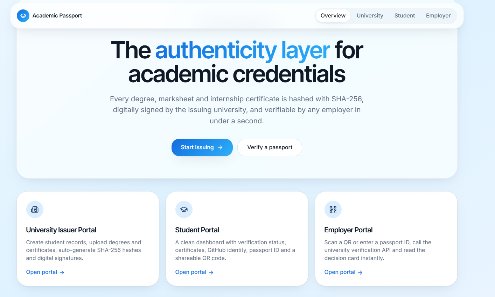
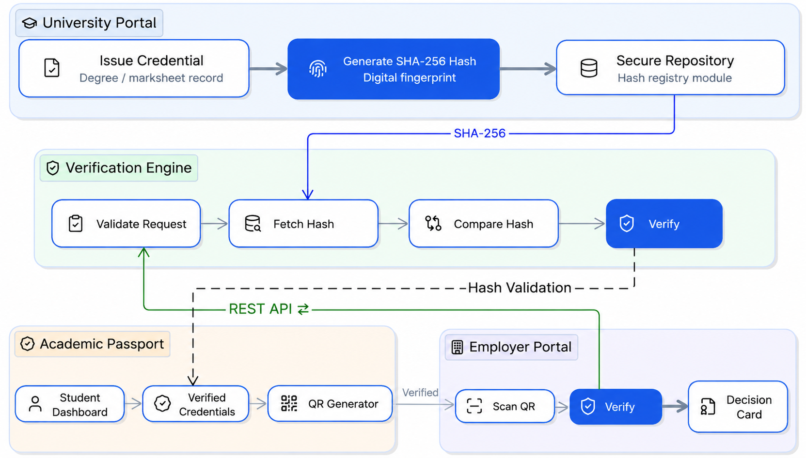

# HashVault — Academic Credential Verification

A prototype for unified academic credential verification using an **Academic Passport, QR-based sharing, and SHA-256 hash validation**.

## 🌐 Project Preview

## 📌 Problem Statement

Academic credentials such as degrees, marksheets, internship certificates and other documents are often maintained across different files or platforms.

When a student applies for a job or higher education, verification may require checking multiple documents manually. This can make the process time-consuming and creates a need for reliable tamper detection.

## 💡 Proposed Solution

**HashVault** proposes a unified **Academic Passport** for verified academic credentials.

The proposed workflow is:

**University → SHA-256 Hash → Secure Repository → Verification Engine → Academic Passport → QR → Employer → Decision Card**

Each credential can be associated with a SHA-256 hash, which acts as a digital fingerprint of the document.

The student can access verified credentials through an Academic Passport and share them using a QR code. An employer can then initiate the verification process through the proposed verification workflow.

## 🏗️ System Architecture

### Main Components

- **University Issuer Portal** — represents the credential-issuing institution.
- **SHA-256 Hash Generation** — generates a digital fingerprint for a document.
- **Secure Repository** — stores the reference hash.
- **Verification Engine** — validates and compares hashes.
- **Academic Passport** — provides a unified view of verified credentials.
- **QR Generator** — enables credential sharing.
- **Employer Portal** — allows an employer to initiate verification.
- **Decision Card** — displays the verification result.

## 🔄 Verification Flow

1. University issues an academic document.
2. A SHA-256 hash is generated for the document.
3. The reference hash is stored in the proposed secure repository.
4. Student credentials are represented in the Academic Passport.
5. Student shares the Academic Passport through a QR code.
6. Employer scans the QR code.
7. The verification request reaches the Verification Engine.
8. The current document hash is compared with the stored reference hash.
9. The system provides the verification result.

## ✨ Key Features

- Unified Academic Passport concept
- QR-based credential sharing
- SHA-256 hash validation
- Employer-focused verification workflow
- University issuer workflow
- Verification result / Decision Card
- REST API-based architecture concept

## 🖥️ Prototype

The current project is an **academic prototype** demonstrating the proposed user flow, interface and system architecture.

The prototype uses a **Demo University Issuer Portal** to represent the university side of the workflow.

### Current Prototype Scope

The prototype demonstrates the proposed concept and workflow. Production-level integrations such as official university APIs, DigiLocker/NAD integration and other external institutional systems are **not implemented in the current prototype**.

## 📊 Project Presentation

The complete project presentation explains the problem, proposed solution, architecture, feasibility, impact and research references.

[📊 View Project Presentation](./docs/HashVault-Presentation.pdf)

## 🔮 Future Scope

Possible future extensions include:

- Official university API integration
- DigiLocker / NAD ecosystem integration
- Integration with institutional academic records
- Scalable cloud deployment
- Additional credential verification workflows
- Further automation of the verification process

## ⚠️ Project Status

**Academic Prototype / Concept Demonstration**

This repository documents the proposed solution, architecture and prototype developed for academic/project presentation purposes.
